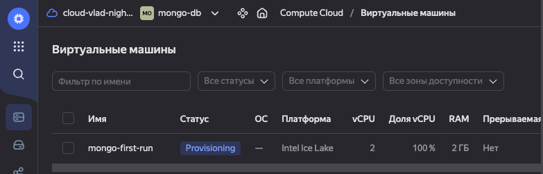
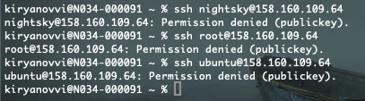
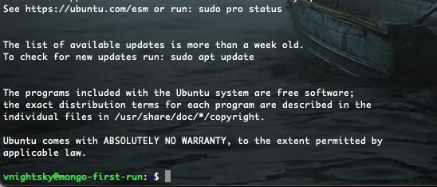
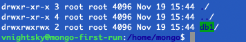
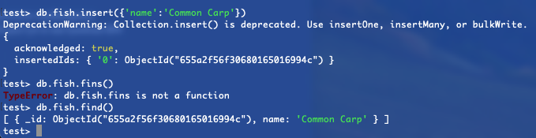
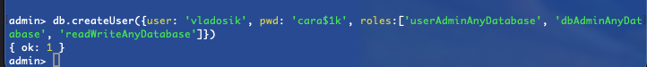

### Установка на Яндекс.Облако MongoDB

1. Перешёл на сайт https://cloud.yandex.ru/
2. Создал виртуальную машину и назвал её mongo-first-run



3. Попробовал подключится командой ```ssh vnightsky@158.160.109.64``` к виртуальной машине. Не получилось.



4. Подключился явно указав ключ ```ssh vnightsky@158.160.109.64 -i .ssh/id_rsa```



5. Устоновил MongoDB командой

```
wget -qO - https://www.mongodb.org/static/pgp/server-7.0.asc | sudo apt-key add -  && echo "deb [ arch=amd64,arm64 ] https://repo.mongodb.org/apt/ubuntu jammy/mongodb-org/7.0 multiverse" | sudo tee /etc/apt/sources.list.d/mongodb-org-7.0.list && sudo apt-get update && sudo DEBIAN_FRONTEND=noninteractive apt-get install -y mongodb-org
```

6. Создал директорию для базы данных командой
```
sudo mkdir /home/mongo && sudo mkdir /home/mongo/db1 && sudo chmod 777 /home/mongo/db1
```



7. Запустил на порту 27001

```
mongod --dbpath /home/mongo/db1 --port 27001 --fork --logpath /home/mongo/db1/db1.log --pidfilepath /home/mongo/db1/db1.pid
```

8. Подключился и добавил в коллекцию рыбку



9. Создал пользователя.



10. Перезапустил MongoDB c защищённым подключением и потестировал подключение под пользователём

